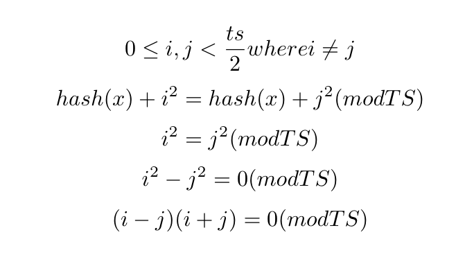

# Data Structures in class notes
**July 24, 2017**

##Table of Contents
1. [Admin](#admin)
2. [Hash Tables](#hash-tables-continued)

##Admin
* Homework 3 due Friday, then programming due Monday
* Question 1 on the final will be on induction proof about graphs
* 

## Hash Tables Continued
* What do we want to do with hash-tables?
	* insert keys
	* contains check - Execute the h_i algorithm until we land on the element or an empty cell
		* Then we have to be careful about our remove methods
	* remove keys
		* We can use lazy deletion to avoid running into the issue with removing an element after probing past it
		* We count lazily deleted elements in our load factor
		* Whenever we grow the array, we can delete all those lazily deleted elements, because we don't care about those elements anymore, and we're going to re-hash all of those elements anyway, so we don't have to worry about deletions and the problems associated with them.

###Probing Hash Tables
* Opening addressing schemes
* Open addressing scheme, there is no serperate chaining; You'll have to find a different slot in-case of a collision
	* this means that the maximum lamda is ``1`` but we really want to shoot for ``1/2``
* In probing, you'll apply the hash function, then mod it by the table size, in-case of a collision you'll have a probing function that takes the location to a next location, producing a sequence, h_i (x)
	* We can call that second probing function f(i) where i is the index
	* Boils down to: ``h_i(x) = (hash(x)+f(i))%TableSize``

####Linear Probing
* The probing function is linear
* ``f(i) = i``
* If we end up with a cluster of linear probes inside out hash-table, we get something called ``primary clustering`` which is the downfall of the ``linear probing`` technique
* 

####Quadratic Probing
* ``f(i) = i^2``
* Everything for linear probing and the bare ADT holds true, but we square the index in case of collisions.
* You need to make the table size prime, or else you'll run into an issue where elements might not be able to be insertable, you'll just run around the table infinitely

#### Proof by contradiction
* Not sure what this proves

<!-- \[ 0 \leq i, j < \frac{ts}{2}  where  i \neq j \]
\[ hash(x) + i^2 = hash(x) + j^2 (mod TS) \]
\[ i^2 = j^2 (mod TS) \]
\[ i^2 - j^2 = 0 (mod TS) \]
\[ (i-j)(i+j) = 0 (mod TS) \] -->

####Double Hashing
* need to review this on your own

####Review the code for Weiss